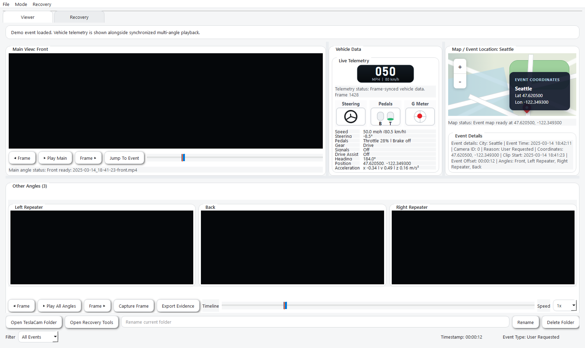
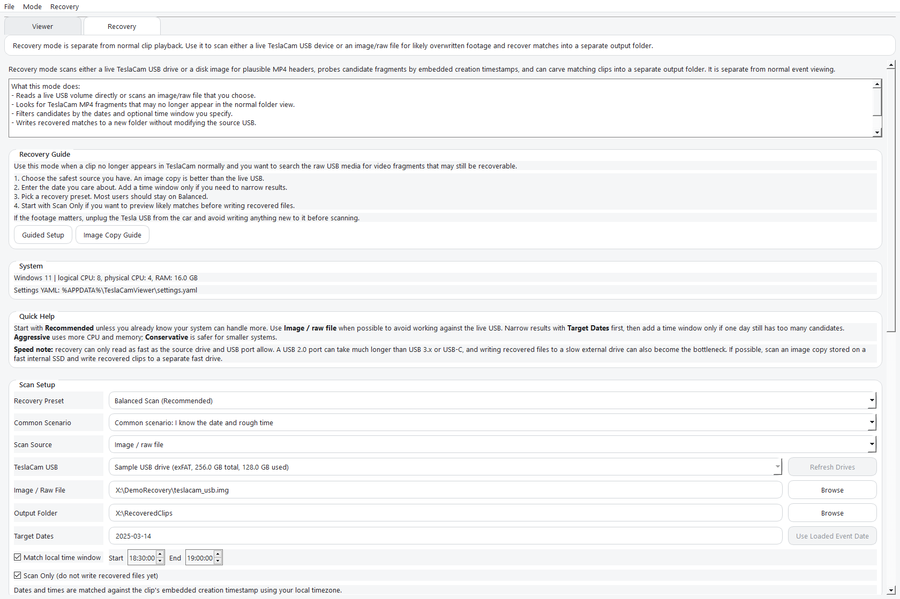

# TeslaCamViewer

TeslaCamViewer helps you review Tesla dashcam and Sentry Mode clips without
juggling separate video files. Open an event folder and the app lines up the
available camera angles, shows the incident point, displays event details, and
helps export still frames or short clips when you need to share what happened.

It also includes a separate recovery workspace for users who need to look for
recoverable TeslaCam MP4 fragments on a USB drive or disk image.

## Why Use It?

- Watch the front, repeater, and rear camera views together
- Jump straight to the recorded event moment
- See location, time, event reason, and available vehicle data in one place
- Export still frames or short clips with useful context attached
- Use recovery tools when footage may have been deleted, truncated, or
  overwritten

## Download And Install

The release downloads install like a normal desktop app. You do not need
Python, Git, or command-line tools unless you want to run the project from
source.

Download the latest build from the
[TeslaCamViewer Releases page](https://github.com/HoDaDor/TeslaCamViewer/releases/latest).

Choose the file that matches your computer:

- Windows: download the file ending in `windows-x64-setup.exe`
- Mac with Apple Silicon: download the file ending in `macos-arm64.dmg`
- Mac with Intel: download the file ending in `macos-x64.dmg`

### Windows

1. Download the `windows-x64-setup.exe` file.
2. Open the downloaded file.
3. Follow the installer prompts.
4. Launch TeslaCamViewer from the Start menu.

### Mac

1. Download the correct `.dmg` file for your Mac.
2. Open the downloaded DMG.
3. Move TeslaCamViewer into Applications if prompted.
4. Open TeslaCamViewer from Applications.

The current Mac builds are not notarized yet, so macOS may ask you to confirm
that you want to open the app the first time.

If you are not sure which Mac you have, open `Apple menu > About This Mac`. If
it says Apple M1, M2, M3, M4, or newer, choose the Apple Silicon download. If it
says Intel, choose the Intel download.

## First Steps

1. Copy the TeslaCam folder from the USB drive to your computer when possible.
2. Open TeslaCamViewer.
3. Click `Open TeslaCam Folder`.
4. Select an event folder from `RecentClips`, `SavedClips`, or `SentryClips`.
5. Use `Go to Event` to jump to the incident point if event metadata is present.

Keeping a copy of the original Tesla files is important. Exports are useful for
sharing and review, but the original files are still the source footage.

## Screenshots

### Viewer Workspace



### Recovery Workspace



## What It Can Do

### Multi-Angle Review

- Finds the available Tesla camera views in the selected folder
- Lines up the views so the same moment can be reviewed from multiple angles
- Lets a side or rear camera become the main view with a click
- Keeps playback controls and event markers visible while reviewing footage

### Event Context

- Reads `event.json` metadata when available
- Shows city, event type, event time, coordinates, and camera details
- Marks the event point on the playback sliders
- Shows speed, steering, pedal, and acceleration data when supported by the clip

### Evidence Export

- Exports still frames and/or short clip excerpts
- Can include contextual overlays such as timestamps, GPS, source filename, and
  event reason
- Writes a manifest with source hashes and event metadata so exported files stay
  tied back to the original clips

The export tools help organize and explain footage. They do not replace
preserving the original Tesla files.

### Recovery Mode

- Scan either a live TeslaCam USB drive or a raw image file
- Filter candidate recoveries by date and optional local time window
- Leverage Qt-native threading for responsive, efficient recovery scans
- Review likely matches and recovered clips in a dedicated results area
- Recover a larger block from a selected result when a clip looks truncated
- Provide advanced controls for raw offsets, carve sizes, and worker tuning

Recovery scans are read-oriented, but live-device recovery should still be run
carefully. If the footage matters, working from a disk image is safer than
working directly from the USB drive. Recovery speed also depends heavily on the
source USB port, the source drive, and the output drive; a USB 2.0 path can take
much longer than USB 3.x or a fast internal SSD.

## Requirements

- Windows 10/11 or macOS
- TeslaCam footage copied from a Tesla USB drive
- `ffprobe` available on `PATH` for recovery workflows

Normal viewing does not require recovery mode. Recovery work is more advanced
and may require Administrator access on Windows when scanning a live USB device.

## Run From Source

Most users should use the release downloads above. This section is only for
development or manual source installs.

```powershell
python -m venv .venv
.\.venv\Scripts\Activate.ps1
pip install -e .
python qtTeslaCam.py
```

After installation, the console command is also available:

```powershell
teslacam-viewer
```

## Technology

- Python 3.11+
- PySide6
- OpenCV
- PyYAML
- psutil
- FFmpeg / `ffprobe`

## Project Layout

- `qtTeslaCam.py`: launcher entrypoint
- `teslacam_app/`: main application package
- `leaflet/`: bundled map assets
- `tests/`: unit tests for metadata, settings, recovery helpers, and telemetry
- `docs/screenshots/`: screenshot assets used by this README

## Documentation

- [docs/ARCHITECTURE.md](docs/ARCHITECTURE.md): module responsibilities and runtime flow
- [docs/DEPLOYMENT.md](docs/DEPLOYMENT.md): desktop build and packaging notes
- [docs/PYSIDE6-LICENSING.md](docs/PYSIDE6-LICENSING.md): practical licensing/compliance notes for PySide6 and Qt
- [THIRD_PARTY_NOTICES.md](THIRD_PARTY_NOTICES.md): dependency license and notice summary
- [docs/github-metadata.md](docs/github-metadata.md): GitHub description, topics, and publishing notes

## Packaging

- Windows setup build: `.\build.ps1 -Force -Installer`
- macOS DMG build: `./build-macos.sh --force --dmg`
- GitHub Releases build separate Apple Silicon and Intel packages.
- Desktop deployment notes: [docs/DEPLOYMENT.md](docs/DEPLOYMENT.md)

## Recovery Notes

- Live USB recovery is Windows-oriented and usually requires Administrator access.
- `ffprobe` must be available on `PATH` for recovery workflows.
- Recovery settings are stored in the user's config directory as YAML, not in the repository.
- Avoid writing anything to the source TeslaCam media while attempting recovery.

## License

- Project source: [MIT](LICENSE)
- Additional dependency notices: [THIRD_PARTY_NOTICES.md](THIRD_PARTY_NOTICES.md)
- Qt / PySide6 compliance notes: [docs/PYSIDE6-LICENSING.md](docs/PYSIDE6-LICENSING.md)
